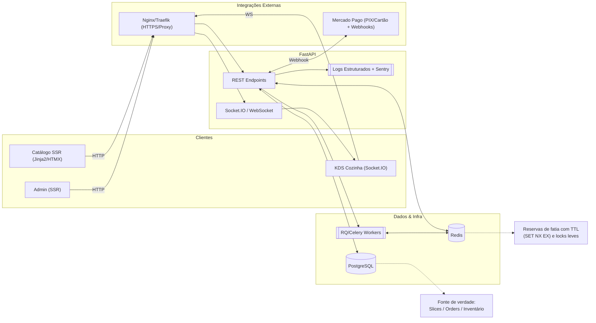
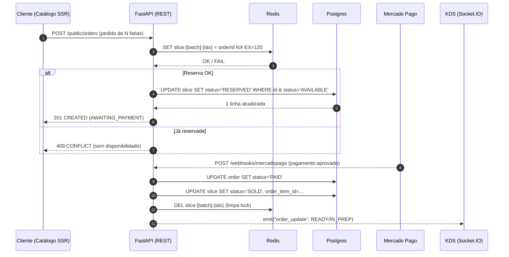
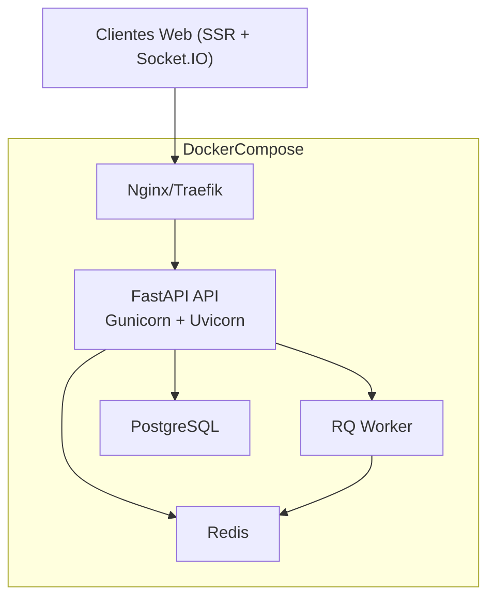

# Meu Pedaço Favorito 🍕

Plataforma multi-tenant para pizzarias venderem **pizza em pedaços** com controle de estoque em tempo real.

---

## 🚀 Stack escolhida

### **Backend: FastAPI**

- Framework Python moderno, rápido e assíncrono.
- Integração nativa com **Pydantic** para validação e tipagem.
- Documentação automática via **Swagger/OpenAPI**.
- Fácil integração com WebSockets (para o KDS/cozinha em tempo real).

👉 **Por que?**  
Equilibra produtividade e performance. Permite que um time pequeno entregue rápido, mas com base sólida para escalar.

---

### **Frontend: Jinja2 + HTMX + AlpineJS (SSR no FastAPI)**

- **Jinja2**: renderização server-side de templates (HTML).
- **HTMX**: atualizações dinâmicas no HTML via atributos (`hx-get`, `hx-post`), sem precisar de SPA pesada.
- **AlpineJS**: interações leves (dropdowns, toggles, modais).
- **Socket.IO client**: real-time para o KDS.

👉 **Por que?**  

- Mantemos tudo em **Python** no início, sem precisar levantar uma app separada em React/Next.js.  
- Reduz complexidade e curva de aprendizado.  
- Rápido para validar o MVP.  
- Se o produto escalar, podemos migrar para React/Next.js sem reescrever o backend.

---

### **Banco de Dados: PostgreSQL**

- Relacional, sólido e open source.
- Suporte robusto para concorrência e integridade transacional (essencial para controle de fatias).
- Ecosistema maduro (ORM SQLAlchemy + Alembic).

👉 **Por que?**  
Controle de estoque exige transações seguras. Postgres é padrão de mercado e bem suportado no cloud.

---

### **Migrations: Alembic**

- Versionamento de schema do banco.
- Permite aplicar e reverter alterações com segurança.

👉 **Por que?**  
Facilita evoluir o modelo de dados conforme novas features entram no roadmap.

---

### **Cache & Concorrência: Redis**

- Utilizado para **reservar fatias** com TTL (lock temporário até o pagamento).
- Suporte a operações atômicas (`SET NX EX`) → evita overbooking de fatias.
- Usado também como **broker** para filas assíncronas.

👉 **Por que?**  
Baixa latência e comandos simples, ideal para gerenciar reservas de estoque em tempo real.

---

### **Filas de Jobs: RQ (ou Celery)**

- Baseadas em Redis.
- Executam tarefas assíncronas como:  
  - confirmação de pagamento via webhook,  
  - expiração de reservas,  
  - notificações.

👉 **Por que?**  
Não travar o fluxo principal da API com tarefas demoradas.  
RQ é simples para começar; Celery é opção se a complexidade crescer.

---

### **WebSockets (Socket.IO)**

- Comunicação em tempo real entre API e KDS (cozinha).
- Permite atualizar status do pedido instantaneamente (ex.: “Em preparo” → “Pronto”).

👉 **Por que?**  
Coerência e rapidez no fluxo de cozinha, sem refresh manual.

---

### **Observabilidade**

- **Logs estruturados** em JSON → fácil de analisar/centralizar.
- **Sentry** para monitorar erros e exceções.

👉 **Por que?**  
Monitorar desde o MVP evita dores de cabeça depois.

---

### **Infraestrutura**

- **Docker** para padronizar ambiente de dev/prod.  
- **Gunicorn + Uvicorn** no deploy (produção).  
- **Nginx ou Traefik** como proxy reverso (TLS, compressão, load balancing).  

👉 **Por que?**  
Boa prática de mercado, escalável e portátil para qualquer cloud.

---

## 📌 Roadmap MVP

1. **Núcleo de pedidos e estoque**  
   - Cadastro de cardápio.  
   - Controle de fatias (abrir pizza → gerar slices).  
   - Pedidos + reservas com Redis TTL.  

2. **Checkout público**  
   - Catálogo (SSR).  
   - Pedido via front → API → reserva fatias.  
   - Integração Mercado Pago (PIX + cartão).  

3. **KDS em tempo real (cozinha)**  
   - Pedidos entram em “Em preparo”.  
   - Mudança para “Pronto” atualiza automaticamente no painel.  

4. **Admin multi-tenant**  
   - Pizzaria gerencia cardápio, batches (pizzas abertas) e pedidos.  

---

## 🏗️ Arquitetura



---

## 🔄 Fluxo de Reserva por Fatia



---

## 📦 Implantação com Docker



---

## 🛠️ Como rodar localmente

```bash
# Ativar venv
.\.venv\Scripts\Activate.ps1

# Instalar dependências
python -m pip install --upgrade pip
python -m pip install -r requirements.txt

# Subir servidor
uvicorn app.main:app --reload
```

Acesse:

- API Docs → [http://127.0.0.1:8000/docs](http://127.0.0.1:8000/docs)
- Healthcheck → [http://127.0.0.1:8000/health](http://127.0.0.1:8000/health)
- Página inicial → [http://127.0.0.1:8000/](http://127.0.0.1:8000/)

---

## 📄 Licença

Projeto em fase de MVP. Direitos reservados.
